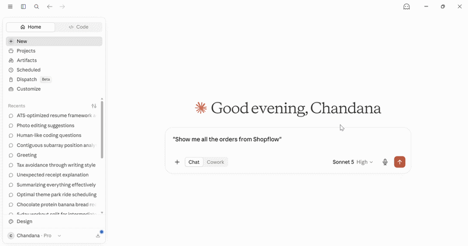

# ShopFlow — Full-Stack E-Commerce Platform

[](https://github.com/GanasalaChandana/Event-Driven-E-Commerce/actions/workflows/ci.yml)

A production-grade full-stack e-commerce platform with a **Next.js frontend** and **Spring Boot microservices backend**. The backend combines four domain services (User, Product, Order, Inventory) into a single deployable monolith using `build-helper-maven-plugin`. Cross-module communication uses Spring `ApplicationEvent` with `@TransactionalEventListener` and `@Async`, with optional Kafka for distributed deployments.

## 🌐 Live Demo

| | Link |
|---|---|
| 🛍️ **Frontend (Vercel)** | https://event-driven-e-commerce.vercel.app |
| ⚙️ **REST API (Render)** | https://event-driven-e-commerce.onrender.com |
| 📖 **Swagger UI** | https://event-driven-e-commerce.onrender.com/swagger-ui.html |

> ⚠️ The free Render backend spins down after inactivity. First request may take **30–60 seconds** to wake up.

### Demo Credentials
| Role | Email | Password |
|---|---|---|
| User | Register at `/register` | your choice |

> Admin credentials are available on request.

---

## 🤖 AI Integration (MCP Server)

ShopFlow includes a [Model Context Protocol (MCP)](https://modelcontextprotocol.io) server that lets Claude AI manage the store through natural language.



### What you can ask Claude

- *"Show me all pending orders"*
- *"Get all products"*
- *"Update inventory for product X to 50 units"*
- *"Confirm order abc-123"*
- *"Show me store statistics"*

### Setup

```bash
cd shopflow-mcp
python -m venv venv
venv\Scripts\activate  # Windows
pip install -r requirements.txt
```

Add to Claude Desktop config (`%APPDATA%\Claude\claude_desktop_config.json`):

```json
{
  "mcpServers": {
    "shopflow": {
      "command": "/path/to/shopflow-mcp/venv/Scripts/python.exe",
      "args": ["/path/to/shopflow-mcp/server.py"],
      "env": {
        "SHOPFLOW_ADMIN_TOKEN": "your-admin-jwt-token"
      }
    }
  }
}
```

---

## Frontend (shopflow-frontend/)

Built with **Next.js 14**, **Tailwind CSS**, and **shadcn/ui**. Connects to the Spring Boot backend via REST API.

| Page | Description |
|---|---|
| `/` | Home page with hero and features |
| `/products` | Product catalog with search, category filter, pagination |
| `/products/[id]` | Product detail page with stock level and order button |
| `/orders` | My orders with cancel button (user) |
| `/orders/confirmation` | Order success screen |
| `/profile` | Account details and order statistics |
| `/login` / `/register` | Auth pages with JWT |
| `/admin` | Dashboard with stats and recent orders |
| `/admin/products` | Product CRUD |
| `/admin/categories` | Category management |
| `/admin/inventory` | Stock adjustment |
| `/admin/orders` | All orders with status update |
| `/admin/users` | All users |

**Stack:** Next.js 14 · TypeScript · Tailwind CSS · shadcn/ui · React Query · Zustand · Axios

---

## Features

- JWT authentication with role-based access (USER / ADMIN)
- Product catalog with full-text search and category filtering
- Order placement with automatic PENDING → CONFIRMED fulfillment
- User-initiated order cancellation (PENDING orders only)
- Admin dashboard: manage all orders, users, inventory, and categories
- Email notifications via Resend API (order confirmed, order cancelled, welcome)
- IP-based rate limiting via Bucket4j (20 req/min)
- Paginated responses throughout
- RFC 9457 Problem Details error format
- OpenAPI 3 spec at `/openapi.yaml`

---

## Architecture

```
Client
  │
  ▼
shopflow-monolith (Spring Boot 3.x, port 10000)
  ├── user-service      — registration, login, JWT, profiles
  ├── product-service   — products, categories, search
  ├── order-service     — place, cancel, track orders
  └── inventory-service — stock management with cache
         │
         ▼ (optional)
   Apache Kafka
   order.created → inventory.reserved → order.confirmed
```

When Kafka is unavailable (Render free tier), fulfillment runs synchronously via Spring `ApplicationEvent` — the order auto-confirms within seconds.

---

## Tech Stack

| Layer | Technology |
|---|---|
| Language | Java 21 (Virtual Threads) |
| Framework | Spring Boot 3.x |
| Security | Spring Security 6 + JWT (JJWT 0.12) |
| Database | PostgreSQL |
| Messaging | Apache Kafka (optional) |
| Email | Resend HTTP API |
| Rate Limiting | Bucket4j 8.x (in-memory) |
| Build | Maven + build-helper-maven-plugin |
| Deployment | Docker + Render.com |

---

## API Reference

**Base URL:** `https://event-driven-e-commerce.onrender.com`

All protected endpoints require:
```
Authorization: Bearer <token>
```

---

### Auth

#### Register
```http
POST /api/v1/auth/register
Content-Type: application/json

{
  "name": "Alice",
  "email": "alice@example.com",
  "password": "secret123"
}
```
**Response — 201 Created**
```json
{
  "token": "eyJhbGci...",
  "userId": "a1b2c3d4-...",
  "email": "alice@example.com",
  "name": "Alice",
  "role": "USER"
}
```
A welcome email is sent to the registered address.

#### Login
```http
POST /api/v1/auth/login
Content-Type: application/json

{
  "email": "alice@example.com",
  "password": "secret123"
}
```
**Response — 200 OK** — same shape as register response.

> **Default admin:** `admin@shopflow.com` / `admin123`

---

### User Profile

#### Get my profile
```http
GET /api/v1/users/me
Authorization: Bearer <token>
```
**Response — 200 OK**
```json
{
  "id": "a1b2c3d4-...",
  "name": "Alice",
  "email": "alice@example.com",
  "role": "USER",
  "createdAt": "2026-06-17T03:26:27"
}
```

#### Get user by ID (Admin only)
```http
GET /api/v1/users/{id}
Authorization: Bearer <admin-token>
```

---

### Categories

#### List all categories (public)
```http
GET /api/v1/categories
```
**Response — 200 OK**
```json
[
  {
    "id": "9129a5e4-99be-4720-b886-4bb0f01813cc",
    "name": "Electronics",
    "description": "Electronic devices and accessories"
  }
]
```

#### Create category (Admin only)
```http
POST /api/v1/categories
Content-Type: application/json
Authorization: Bearer <admin-token>

{
  "name": "Electronics",
  "description": "Electronic devices and accessories"
}
```
**Response — 201 Created** — category object.

---

### Products

#### List products (public)
```http
GET /api/v1/products?page=0&size=20&q=headphones&categoryId=<uuid>
```

| Param | Description |
|---|---|
| `q` | Full-text search on name and description |
| `categoryId` | Filter by category UUID |
| `page` | Page number (0-indexed, default 0) |
| `size` | Items per page (default 20) |

**Response — 200 OK** — paginated product list.

#### Get product by ID (public)
```http
GET /api/v1/products/{id}
```

#### Create product (Admin only)
```http
POST /api/v1/products
Content-Type: application/json
Authorization: Bearer <admin-token>

{
  "name": "Wireless Headphones",
  "description": "Noise-cancelling headphones",
  "price": 99.99,
  "sku": "WH-001",
  "categoryId": "9129a5e4-99be-4720-b886-4bb0f01813cc"
}
```
**Required:** `name`, `price`, `sku`  
**Response — 201 Created** — product object.

#### Update product (Admin only)
```http
PUT /api/v1/products/{id}
Content-Type: application/json
Authorization: Bearer <admin-token>

{
  "name": "Wireless Headphones Pro",
  "price": 129.99,
  "sku": "WH-001-PRO",
  "categoryId": "9129a5e4-99be-4720-b886-4bb0f01813cc"
}
```

#### Delete product (Admin only)
```http
DELETE /api/v1/products/{id}
Authorization: Bearer <admin-token>
```
**Response — 204 No Content** (soft delete — preserves order history)

---

### Inventory

#### Check stock (public)
```http
GET /api/v1/inventory/{productId}
```
**Response — 200 OK**
```json
{
  "id": "...",
  "productId": "ee04ec8d-...",
  "productName": "Wireless Headphones",
  "quantity": 200,
  "reservedQuantity": 0,
  "availableQuantity": 200
}
```

#### Add stock (Admin only)
```http
POST /api/v1/inventory
Content-Type: application/json
Authorization: Bearer <admin-token>

{
  "productId": "ee04ec8d-...",
  "productName": "Wireless Headphones",
  "quantityToAdd": 100
}
```

#### Set absolute stock quantity (Admin only)
```http
PUT /api/v1/inventory/{productId}
Content-Type: application/json
Authorization: Bearer <admin-token>

{
  "quantity": 200
}
```
**Response — 200 OK** — updated inventory object.

---

### Orders

#### Place order (authenticated)
```http
POST /api/v1/orders
Content-Type: application/json
Authorization: Bearer <token>

{
  "items": [
    {
      "productId": "ee04ec8d-...",
      "productName": "Wireless Headphones",
      "quantity": 1,
      "unitPrice": 99.99
    }
  ]
}
```
**Response — 201 Created**
```json
{
  "id": "f07d7d48-...",
  "userId": "a1b2c3d4-...",
  "userEmail": "alice@example.com",
  "status": "PENDING",
  "totalAmount": 99.99,
  "items": [...],
  "createdAt": "2026-06-18T22:10:08",
  "updatedAt": "2026-06-18T22:10:08"
}
```
A confirmation email is sent once the order moves to `CONFIRMED`.

#### Order status lifecycle
```
PENDING → CONFIRMED   (stock reserved automatically)
        → CANCELLED   (insufficient stock, or cancelled by user/admin)
```

#### List my orders (authenticated)
```http
GET /api/v1/orders?page=0&size=10
Authorization: Bearer <token>
```

#### Get order by ID (authenticated)
```http
GET /api/v1/orders/{id}
Authorization: Bearer <token>
```

#### Cancel order (authenticated — PENDING only)
```http
POST /api/v1/orders/{id}/cancel
Authorization: Bearer <token>
```
Only the order owner can cancel. Only `PENDING` orders can be cancelled.  
**Response — 200 OK** — updated order with `status: CANCELLED`.  
**Response — 409 Conflict** — if order is not in PENDING status.

A cancellation email is sent to the order owner.

---

### Admin — Orders

#### Get all orders (paginated)
```http
GET /api/v1/admin/orders?page=0&size=20&status=PENDING
Authorization: Bearer <admin-token>
```
`status` filter accepts: `PENDING`, `CONFIRMED`, `CANCELLED`

#### Get any order by ID
```http
GET /api/v1/admin/orders/{id}
Authorization: Bearer <admin-token>
```

#### Update order status
```http
PATCH /api/v1/admin/orders/{id}/status
Content-Type: application/json
Authorization: Bearer <admin-token>

{
  "status": "CONFIRMED"
}
```
**Response — 200 OK** — updated order object. A status email is sent to the customer.

---

### Admin — Users

#### List all users (paginated)
```http
GET /api/v1/admin/users?page=0&size=20
Authorization: Bearer <admin-token>
```

#### Get user by ID
```http
GET /api/v1/admin/users/{id}
Authorization: Bearer <admin-token>
```

---

## Email Notifications

Sent via [Resend](https://resend.com) HTTP API:

| Trigger | Email |
|---|---|
| User registers | Welcome email |
| Order confirmed | Order confirmation with items and total |
| Order cancelled (by user) | Cancellation notice |
| Admin updates order to CONFIRMED | Confirmation email |
| Admin updates order to CANCELLED | Cancellation notice |

---

## Rate Limiting

IP-based, in-memory via Bucket4j:
- **20 requests per minute** per IP
- Exceeding the limit returns `429 Too Many Requests`

---

## Error Format

All errors follow [RFC 9457 Problem Details](https://datatracker.ietf.org/doc/html/rfc9457):

```json
{
  "type": "about:blank",
  "title": "Bad Request",
  "status": 400,
  "detail": "name is required",
  "instance": "/api/v1/products"
}
```

| Status | Meaning |
|---|---|
| 400 | Validation failed |
| 401 | Missing or invalid JWT |
| 403 | Insufficient role |
| 404 | Resource not found |
| 409 | Business rule conflict (e.g. cancel non-PENDING order, duplicate SKU) |
| 429 | Rate limit exceeded |
| 500 | Internal server error |

---

## Running Locally

**Prerequisites:** Java 21, Maven 3.9+, Docker Desktop

### 1. Start infrastructure
```bash
docker compose up -d
```
Starts PostgreSQL, Kafka, Zookeeper, and Kafka UI (http://localhost:8090).

### 2. Set environment variables
```bash
export RESEND_API_KEY=re_your_key_here
export JWT_SECRET=your-256-bit-secret
```

### 3. Run the monolith
```bash
cd shopflow-monolith
mvn spring-boot:run
```
API available at `http://localhost:10000`

### Environment variables

| Variable | Default | Description |
|---|---|---|
| `SPRING_DATASOURCE_URL` | `jdbc:postgresql://localhost:5432/shopflow_db` | PostgreSQL URL |
| `SPRING_DATASOURCE_USERNAME` | `shopflow` | DB username |
| `SPRING_DATASOURCE_PASSWORD` | `shopflow123` | DB password |
| `JWT_SECRET` | dev default | Min 256-bit in production |
| `SPRING_KAFKA_BOOTSTRAP_SERVERS` | `localhost:9092` | Kafka broker (optional) |
| `RESEND_API_KEY` | — | Resend API key for emails |

---

## Project Structure

```
shopflow/
├── docker-compose.yml
├── Dockerfile.monolith
├── shopflow-monolith/          ← deployable artifact
│   └── src/main/java/com/shopflow/monolith/
│       ├── config/             ← Security, JWT filter, rate limiting, event listeners
│       ├── controller/         ← Admin controllers
│       ├── exception/          ← Global exception handler
│       └── notification/       ← Email service (Resend)
├── user-service/
├── product-service/
├── order-service/
└── inventory-service/
```

Each service follows:
```
src/main/java/com/shopflow/<service>/
├── controller/
├── service/
├── repository/
├── entity/
├── dto/
├── event/
├── config/
└── exception/
```

---

## GitHub

[github.com/GanasalaChandana/Event-Driven-E-Commerce](https://github.com/GanasalaChandana/Event-Driven-E-Commerce)
